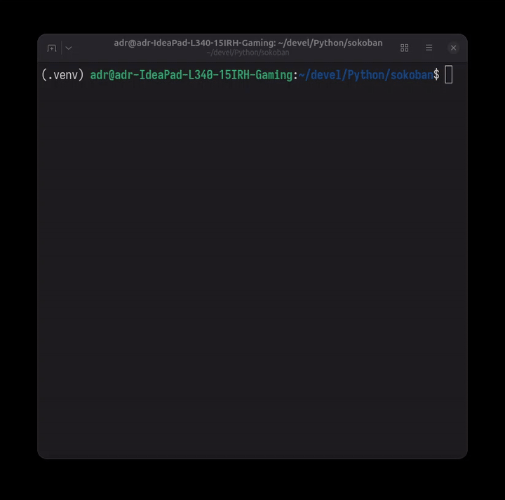

# Sokoban Solver (Python)

This is a basic Sokoban game implementation in Python, with a text-based user interface (TUI) using the `curses` library. It also includes some search algorithms for solving the puzzles.

## Features

*   Text-based Sokoban game.
*   Movement using `w`, `a`, `s`, `d` keys.
*   Menu with algorithm options.
*   Search algorithms: BFS, DFS, A*, Hill Climbing, Uniform Cost Search.

# Demo


## Requirements

Install the required packages using `pip`:

```bash
python -m venv .venv
. ./.venv/bin/activate
pip install -r requirements.txt
```

The `requirements.txt` file contains the following:

```
numpy==2.3.3
```


## Usage

1.  Make sure you have Python 3 and the `curses` library
2.  Run the `game.py` script.

    ```bash
    python3 game.py [game_easy.config]
    ```


## License

This project is licensed under the MIT License - see the [LICENSE.md](LICENSE.md) file for details.
